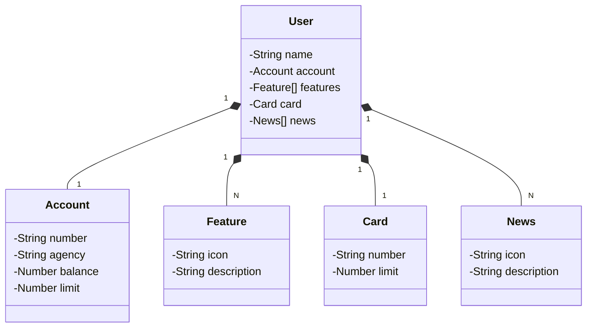

# API REST - Projeto Educacional

Bem-vindo ao repositório da minha **API REST**, desenvolvida com foco educacional para explorar tecnologias modernas e boas práticas no desenvolvimento de APIs. Aqui, foram aplicados conceitos essenciais para criar uma API robusta, segura e bem documentada.

## 🚀 Principais Tecnologias

- **Java 17**: Versão LTS mais recente do Java para aproveitar os recursos mais modernos e eficientes da linguagem.
- **Spring Boot 3**: Framework que facilita o desenvolvimento, oferecendo autoconfiguração e alto desempenho.
- **Spring Data JPA**: Simplifica o acesso a bancos de dados SQL, reduzindo a necessidade de código boilerplate.
- **OpenAPI (Swagger)**: Proporciona uma documentação clara e interativa para a API, facilitando a compreensão e o consumo dos endpoints.
- **Railway**: Plataforma que facilita o deploy na nuvem, fornecendo suporte para bancos de dados e pipelines de CI/CD.

## 📌 Estrutura do Projeto

O projeto segue uma arquitetura bem definida para garantir organização e escalabilidade. As principais camadas incluem:

- **Controller**: Responsável por expor os endpoints da API.
- **Service**: Contém a lógica de negócio.
- **Repository**: Comunicação com o banco de dados utilizando Spring Data JPA.

## 📊 Diagrama de Classes

Abaixo, temos o **Diagrama de Classes** representando o domínio da API. Este modelo foi criado com viés educacional, auxiliando na compreensão da estrutura e relacionamento entre as entidades do sistema.




## 🔧 Como Executar o Projeto

1. Clone este repositório:
   ```bash
   git clone https://github.com/seu-usuario/seu-repositorio.git
   ```
2. Acesse a pasta do projeto:
   ```bash
   cd nome-do-projeto
   ```
3. Configure o banco de dados no arquivo `application.properties`.
4. Execute o projeto com o Maven:
   ```bash
   mvn spring-boot:run
   ```
5. Acesse a documentação da API no Swagger:
   ```
   http://localhost:8080/swagger-ui.html
   ```

## 📌 Melhorias Futuras

- Implementação de autenticação e autorização com Spring Security.
- Adição de testes automatizados para garantir a qualidade do código.
- Integração com bancos de dados NoSQL para maior flexibilidade.
- Monitoramento e logs aprimorados para observabilidade.

## 🎓 Contribuição

Este projeto tem um propósito educacional, então fique à vontade para explorar, modificar e sugerir melhorias! Se quiser contribuir, abra uma issue ou pull request.

---

📢 **Gostou do projeto? Deixe uma ⭐ no repositório!**


